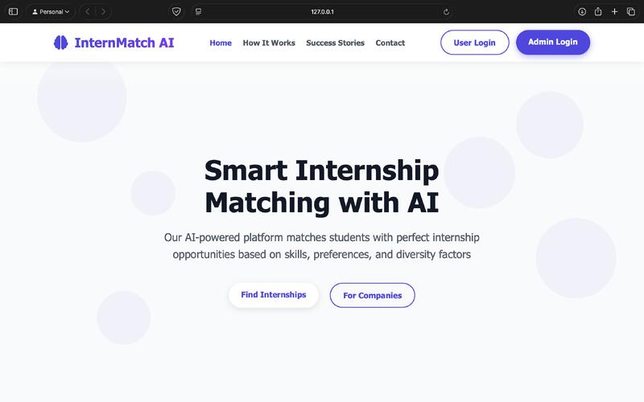

<!-- HEADER: BANNER + GIF -->
<table>
<tr>
<td width="65%">

</td>

<td width="35%" align="center">

</td>
</tr>
</table>

  

<h3 align="center">B.Tech Computer Engineering Student | AI • ML • Full Stack</h3>

  

---

✨ 🚀 ✨

---

## 🔧 Skills

<table>
<tr>
<td align="center" width="160"> <b>C</b></td>
<td align="center" width="160"> <b>C++</b></td>
<td align="center" width="160"> <b>Java</b></td>
<td align="center" width="160"> <b>Python</b></td>
<td align="center" width="160"> <b>JavaScript</b></td>
</tr>

<tr>
<td align="center"> <b>HTML</b></td>
<td align="center"> <b>CSS</b></td>
<td align="center"> <b>React</b></td>
<td align="center"> <b>Node.js</b></td>
<td align="center"> <b>MySQL</b></td>
</tr>

<tr>
<td align="center"> <b>TensorFlow</b></td>
<td align="center"> <b>Git</b></td>
<td align="center"> <b>GitHub</b></td>
<td align="center"> <b>Figma</b></td>
<td align="center"> <b>Linux</b></td>
</tr>
</table>

---

✨ 🚀 ✨

---

## 🧑🏻‍💻 My Setup
- 💻 **MacBook Air (M2)**
- 🖥️ **Windows PC**
- 💾 SSD + HDD multi-OS (Linux & Windows)

---

✨ 🚀 ✨

---

## 📂 Featured Projects

<table>
<tr>
<td width="50%" align="center">

### 🤖 AI-Based Smart Internship Allocation System
AI-powered system that intelligently matches students with internships using  
**skill fit, preferences, and scoring algorithms**.

🔹 AI • ML • Node.js • MySQL  
🔹 Fair & Transparent Allocation  

</td>

<td width="50%" align="center">

### 🎉 Eventify – College Event Management Platform
Role-based platform to manage **college events, teams, and registrations**.

🔹 Full Stack • Role-Based Access  
🔹 Organizer • Teacher • Student Panels  

</td>
</tr>
</table>

---

✨ 🚀 ✨

---

## 🌱 Currently Learning
- Data Structures & Algorithms (DSA)
- Advanced Java
- AI / Machine Learning
- System Design
- Backend Architecture

---

✨ 🚀 ✨

---

## 🏆 Certifications & Achievements
- 🏅 Certified in **AI for India**
- 🏅 Certified in **Web Development**
- 🏅 Academic Project Contributor

---

✨ 🚀 ✨

---

## 📊 GitHub Stats

  

  

  

---

✨ 🚀 ✨

---

## 📫 Connect With Me
- 📧 **Email:** rohitsukale2309@gmail.com  
- 💼 **LinkedIn:** https://www.linkedin.com/in/rohitsukale/

---

### ✨ Quote
_"Build skills so strong that opportunities chase you."_

  

---

✨ 🚀 ✨

---
